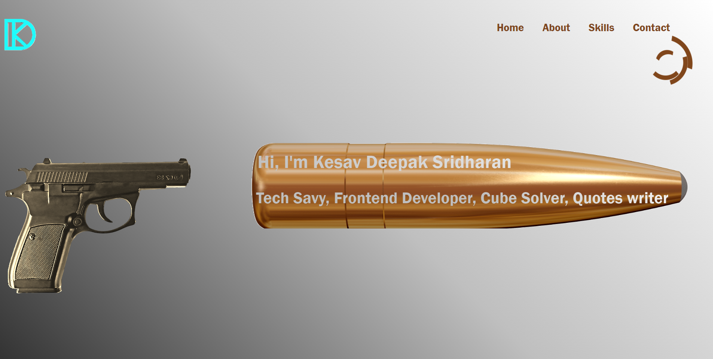

# EX01 Developing a Simple Webserver
## Date:

## AIM:
To develop a simple webserver to serve html pages.

## DESIGN STEPS:
### Step 1: 
HTML content creation.

### Step 2:
Design of webserver workflow.

### Step 3:
Implementation using Python code.

### Step 4:
Serving the HTML pages.

### Step 5:
Testing the webserver.

## PROGRAM:
```python
<!DOCTYPE html>
<html lang="en">
<head>
    <meta charset="UTF-8">
    <meta name="viewport" content="width=device-width, initial-scale=1.0">
    <title>Portfolio Website</title>
    <link rel="icon"type="image/x-icon" href="Untitled.png" >
    <link rel="stylesheet" href="styles.css">
</head>
<body>
    <div class="top" id = "home">
    
    <div class="menu">
        <ol>    
            <li><a href="#home">Home</a></li>
            <li><a href="#about">About</a></li>
            <li><a href="#skill">Skills</a></li>
            <li><a href="">Contact</a></li>
        </ol>
    </div>
    <div class="circle" style = "margin-left: 55%;
    margin-top: 45px;">
        <div class="c1"><div class="c2"><div class="c3"></div></div></div>
    </div>
    </div>
    <div class="g">
    <br>
    
    </div>
    <div class="mid">
         <h2>Hi, I'm Kesav Deepak Sridharan</h2>
        <h3>Tech Savy, Frontend Developer, Cube Solver, Quotes writer
        </h3>
    </div>


</body>
</html>
```
## OUTPUT:


## RESULT:
The program for implementing simple webserver is executed successfully.
